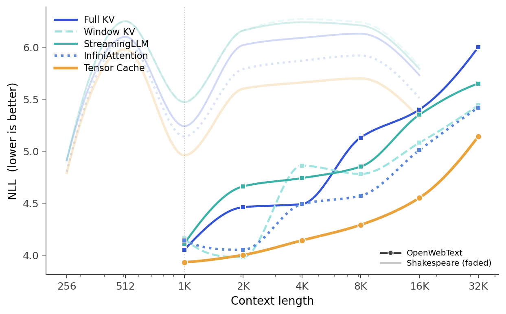
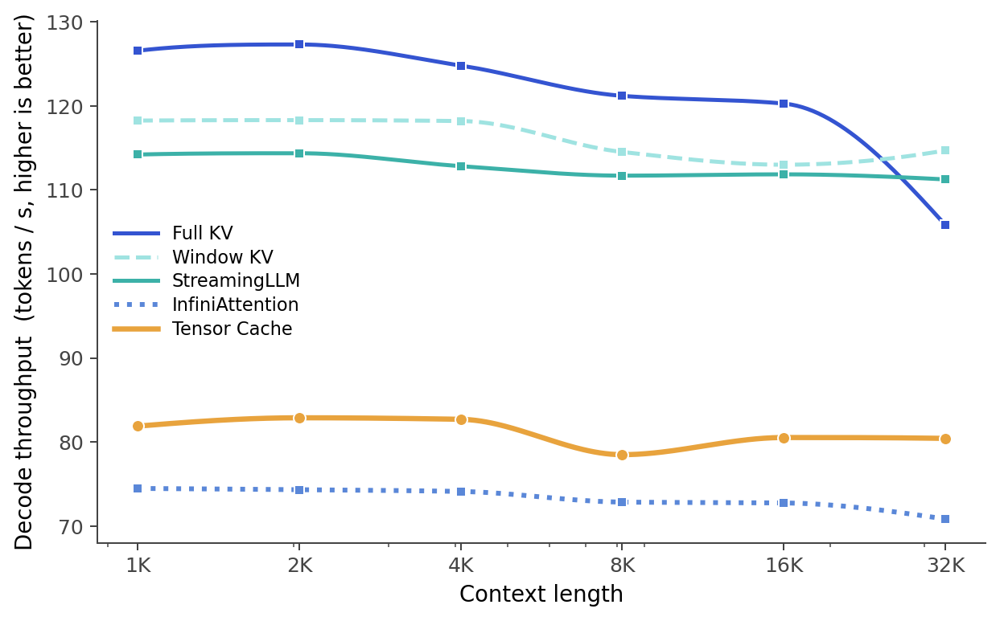

# Tensor Cache: Eviction-conditioned Associative Memory for Transformers

<p align="center">
  <a href="#">Project Page</a> &nbsp;·&nbsp;
  <a href="#">Paper</a> &nbsp;·&nbsp;
  <a href="#">arXiv</a>
</p>

A transformer with **constant-memory long context**. A fixed-size matrix `A` per attention head — the *tensor cache* — absorbs evicted KV entries from a sliding window, so the model carries arbitrarily long context at bounded memory cost. Trained end-to-end with the usual LM loss.

The math and algorithm are in [`tensor_cache/tensor_cache.md`](tensor_cache/tensor_cache.md). The minimal reference implementation is in [`tensor_cache/reference.py`](tensor_cache/reference.py).

## Results

<p align="center">
  
  
</p>

**Left:** NLL by context length. Tensor cache holds quality past the trained context where window-KV degrades, while keeping window-KV-level memory. **Right:** prefill throughput by context length — full-KV's quadratic cost shows up as a steep drop, tensor cache stays roughly flat.

## Install

```
pip install -r requirements.txt
```

## Quick start

Train a tiny model on Shakespeare to see everything end to end:

```
$ python data/shakespeare/prepare.py
$ python tensor_cache/train.py --dataset=shakespeare --kv_mode=tc --kv_window=128 --tc_write_on_evict=True
$ python tensor_cache/sample.py --out_dir=out --kv_mode=tc --kv_window=128
```

That's the whole loop: prepare data, train, sample. The same scripts run the four baselines below — only the `kv_mode` flag changes.

## Comparison

Five `kv_mode` flags share the same model code, same hyperparameters, different long-context mechanism:

| `kv_mode`       | mechanism                                            | KV memory   |
|-----------------|------------------------------------------------------|-------------|
| `full_kv`       | Unbounded KV cache (textbook attention)              | O(L)        |
| `window_kv`     | Sliding window of size W                             | O(W)        |
| `streaming_llm` | Sliding window + attention sinks                     | O(W)        |
| `infini`        | Sliding window + Infini-attention compressive memory | O(W + H·D²) |
| `tc`            | **Sliding window + tensor cache (this work)**        | O(W + H·D²) |

Train each on OpenWebText:

```
$ python tensor_cache/train.py --dataset=openwebtext --out_dir=out_full_kv       --kv_mode=full_kv       --kv_window=0
$ python tensor_cache/train.py --dataset=openwebtext --out_dir=out_window_kv     --kv_mode=window_kv     --kv_window=512
$ python tensor_cache/train.py --dataset=openwebtext --out_dir=out_streaming_llm --kv_mode=streaming_llm --kv_window=512
$ python tensor_cache/train.py --dataset=openwebtext --out_dir=out_infini        --kv_mode=infini        --kv_window=512
$ python tensor_cache/train.py --dataset=openwebtext --out_dir=out_tc            --kv_mode=tc            --kv_window=512
```

For multi-GPU training, prepend `torchrun --standalone --nproc_per_node=<N>`.

## Datasets

```
$ python data/shakespeare/prepare.py             # toy / smoke-test
$ python data/wikitext2/prepare.py               # ~2M training tokens
$ python data/openwebtext/prepare.py             # full ~9B tokens
```

OpenWebText subset for fast iteration:

```
$ python data/openwebtext/prepare.py --out_dir=data/openwebtext_small \
        --max_train_tokens=100000000 --max_val_tokens=4000000
```

## Evaluation

Distance-stratified NLL on a long-context stream from a trained checkpoint:

```
$ python tensor_cache/evaluate.py --init_from=resume --out_dir=out_tc --kv_mode=tc \
        --kv_window=512 --eval_tokens=32768 --output_csv=results/owt_nll.csv
```

Memory and throughput benchmark across context lengths (no checkpoint required — uses random weights):

```
$ python tensor_cache/bench.py --bench_task=long_context \
        --bench_modes=full_kv,window_kv,streaming_llm,infini,tc \
        --kv_window=512 --output_csv=results/owt_long_context.csv
```

## Plotting

`tensor_cache/utils.py` doubles as a CLI that renders the NLL-vs-context figure. It reads any CSV with `mode`, `context_length` (or `eval_tokens`), `nll` (or `nll_all`) columns — both `bench.py` and `evaluate.py` outputs match.

```
$ python tensor_cache/utils.py \
        --foreground=results/owt_nll.csv         --foreground_label='OpenWebText' \
        --background=results/shakespeare_nll.csv --background_label='Shakespeare (faded)' \
        --trained_ctx=1024 \
        --out=results/fig_owt_nll_vs_ctx
```

## Configuration

Every script declares its config variables at the top of the file, overridable via `--key=value` on the command line. The headline knobs:

| flag                | default     | meaning                                          |
|---------------------|-------------|--------------------------------------------------|
| `kv_mode`           | `window_kv` | inference mode (table above)                     |
| `kv_window`         | `512`       | sliding window size                              |
| `tc_write_on_evict` | `True`      | write to tensor cache on KV eviction             |
| `tc_update_rule`    | `delta`     | `delta`, `outer`, or `wedge`                     |
| `tc_chunk_size`     | `64`        | chunk size for the differentiable training scan  |
| `tc_layers`         | `-1`        | which layers get TC (`-1` = all, `k` = top-k)    |
| `tc_num_slots`      | `1`         | TC slots per head                                |
| `tc_two_timescales` | `False`     | enable fast+slow dual TC states                  |

The full list lives at the top of `tensor_cache/train.py`.


## Citation

```bibtex
@misc{swain2026tensorcache,
      title={Tensor Cache: Eviction-conditioned Associative Memory for Transformers},
      author={Kabir Swain and Sijie Han and Daniel Karl I. Weidele and Mauro Martino and Antonio Torralba},
      year={2026},
      eprint={XXXX.XXXXX},
      archivePrefix={arXiv},
      primaryClass={cs.AI},
      url={https://arxiv.org/abs/XXXX.XXXXX},
}
```

## Acknowledgements

We would like to thank Manel Baradad ([@mbaradad](https://github.com/mbaradad)) and Minyoung Huh ([@minyoungg](https://github.com/minyoungg)) for their helpful advice and discussion.
